# Full-Stack Microservices Showcase

This project demonstrates a complete microservices architecture using Spring Boot, Spring Cloud, and React. It includes service discovery, an API gateway, inter-service communication, and a message broker.

## Architecture

The application consists of the following services:

- **service-registry**: A Eureka server for service registration and discovery.
- **api-gateway**: A Spring Cloud Gateway that acts as the single entry point for all client requests.
- **product-service**: A microservice for managing products.
- **offer-service**: A microservice for managing offers. It communicates with the `product-service` using OpenFeign.
- **microservice-ui**: A React.js single-page application that serves as the user interface.
- **RabbitMQ**: A message broker for asynchronous communication (dependencies are set up, but implementation is for future extension).

```mermaid
graph TD
    Browser[Browser] --> UI[microservice-ui<br/>Frontend<br/>Port: 3000]

    UI --> Gateway[api-gateway<br/>Port: 8000<br/>🔵 Eureka Client]

    Gateway --> ProductService[product-service<br/>Port: 8081<br/>🔵 Eureka Client]
    Gateway --> OfferService[offer-service<br/>Port: 8082<br/>🔵 Eureka Client]

    OfferService -- OpenFeign --> ProductService

    ProductService -.-> Eureka[service-registry<br/>Port: 8761]
    OfferService -.-> Eureka
    Gateway -.-> Eureka

    ProductService -.-> RabbitMQ[RabbitMQ<br/>Port: 5672]
    OfferService -.-> RabbitMQ

    classDef frontend fill:#e1f5fe
    classDef gateway fill:#f3e5f5
    classDef service fill:#fff3e0
    classDef infrastructure fill:#f1f8e9

    class Browser,UI frontend
    class Gateway gateway
    class ProductService,OfferService service
    class Eureka,RabbitMQ infrastructure
```



## Prerequisites

Before you begin, ensure you have the following installed:
- **Java 17** or later
- **Maven 3.8** or later
- **Node.js 14** or later (with npm)
- **Docker**

## How to Run the Application

To get the full application running locally, follow these steps in order.

### 1. Start the Infrastructure (RabbitMQ)

Open a terminal and run the following Docker command to start a RabbitMQ container.
```bash
docker run -it --rm --name rabbitmq -p 5672:5672 -p 15672:15672 rabbitmq:3.13-management
```
The RabbitMQ management UI will be available at [http://localhost:15672](http://localhost:15672) (user: `guest`, pass: `guest`).

### 2. Build and Run the Backend Services

The backend services must be started in the following order. It is recommended to use a separate terminal for each service.

#### a. Start the Service Registry (`service-registry`)
```bash
cd service-registry
mvn spring-boot:run
```
Wait for the application to start. You can view the Eureka dashboard at [http://localhost:8761](http://localhost:8761).

#### b. Start the API Gateway (`api-gateway`)
```bash
cd api-gateway
mvn spring-boot:run
```

#### c. Start the Product Service (`product-service`)
```bash
cd product-service
mvn spring-boot:run
```

#### d. Start the Offer Service (`offer-service`)
```bash
cd offer-service
mvn spring-boot:run
```

After starting all services, you can check the Eureka dashboard to confirm that `api-gateway`, `product-service`, and `offer-service` are registered.

### 3. Run the Frontend Application

#### a. Install Dependencies
In a new terminal, navigate to the `microservice-ui` directory and install the required npm packages.
```bash
cd microservice-ui
npm install
```

#### b. Start the React App
```bash
npm start
```
This will automatically open the application in your default web browser at [http://localhost:3000](http://localhost:3000).

## 4. Verify the Setup

Once all services and the frontend are running, you can test the complete system:

1.  **Open the application** in your browser at [http://localhost:3000](http://localhost:3000).
2.  **Fetch Products**: Click the "Fetch Products" button. You should see a list of products (`["Product A", "Product B", "Product C"]`) fetched from the `product-service`.
3.  **Fetch Offers**: Click the "Fetch Offers" button. You should see a list of offers (`["Offer 1: 10% off", "Offer 2: Buy one get one free"]`) fetched from the `offer-service`.
4.  **Test Inter-service Communication**: Open a new browser tab and navigate to [http://localhost:8000/offer/with-products](http://localhost:8000/offer/with-products). This endpoint on the `offer-service` calls the `product-service` via OpenFeign and should display both offers and products.
5.  **Check H2 Consoles**:
    -   Product Service H2 Console: [http://localhost:8081/h2-console](http://localhost:8081/h2-console)
    -   Offer Service H2 Console: [http://localhost:8082/h2-console](http://localhost:8082/h2-console)
    (Use the default JDBC URL `jdbc:h2:mem:testdb` and connect)
